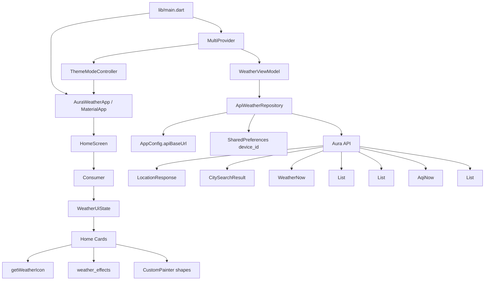
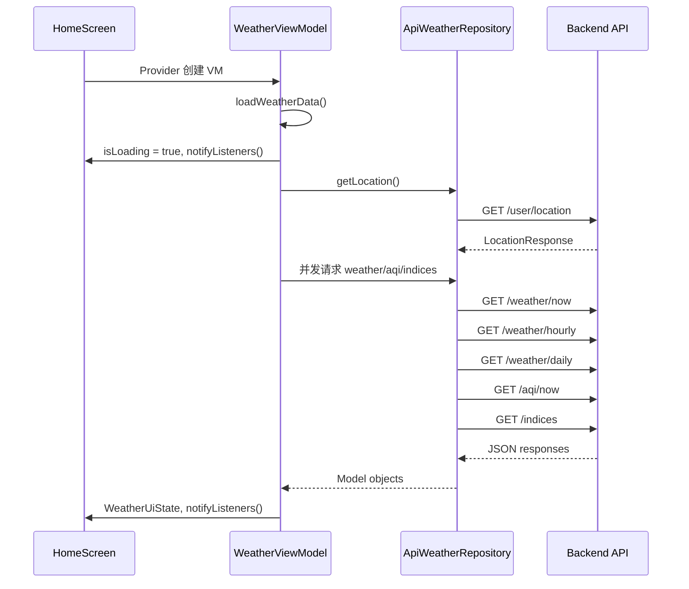
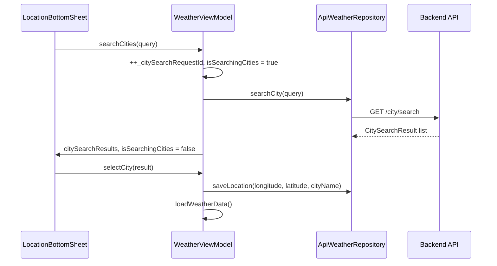

# Aura 前端代码级架构文档

本文档面向后续功能扩展和维护，基于当前仓库中的 Flutter 前端实现整理。代码范围主要是 `lib/`、`test/`、`pubspec.yaml`、`assets/icons/` 和与前端 API 契约相关的 `openapi.json`。

## 1. 项目定位

Aura Weather 是一个 Flutter 天气应用。当前前端以单页首页为核心，访问后端 API 获取用户位置、实时天气、逐小时预报、逐日预报、空气质量和生活指数数据，再组合成天气首页。其中用户位置接口依赖本地持久化的设备 ID。

当前技术栈如下：

| 类别 | 实现 |
| --- | --- |
| UI 框架 | Flutter，Material 3 |
| 状态管理 | `provider` + `ChangeNotifier` |
| 网络请求 | `http.Client` |
| 本地持久化 | `shared_preferences` 保存 `device_id` |
| ID 生成 | `uuid` |
| 时间格式化 | `intl` |
| 图标字体 | `cupertino_icons` |
| 静态资源 | `assets/icons/` 下的 pixel weather icons |
| 静态检查和测试 | `flutter_lints`、`flutter_test`，通过 `flutter analyze` 和 `flutter test` 运行 |

## 2. 目录结构

当前前端核心目录如下：

```text
lib/
  main.dart                         # 应用入口，Provider 注入，MaterialApp 配置
  config/
    app_config.dart                 # API base URL 配置
  data/
    api_repository.dart             # 后端 API 访问层
  models/
    location.dart                   # 位置响应模型
    weather_now.dart                # 实时天气模型
    weather_hourly.dart             # 逐小时天气模型
    weather_daily.dart              # 逐日天气模型
    indices.dart                    # AQI 与生活指数模型
  viewmodels/
    theme_mode_controller.dart       # 主题模式持久化和切换控制器
    weather_view_model.dart         # 首页数据编排和状态更新
    weather_ui_state.dart           # 首页 UI 状态快照
  ui/
    home_screen.dart                # 首页容器和主组件编排
    weather_effects.dart            # 设计 token、天气背景和共享视觉卡片
    hourly_forecast_card.dart       # 逐小时预报卡片
    daily_forecast_card.dart        # 逐日预报卡片
    details_grid.dart               # 当前天气详情网格
    aqi_section.dart                # 空气质量展示
    location_bottom_sheet.dart      # 位置选择弹窗，真实城市搜索和切换入口
    shapes/                         # 自定义 CustomPainter 视觉元素
  utils/
    weather_icons.dart              # 天气 icon code 到本地图片资源的映射

assets/icons/                       # 天气图标资源
test/                               # Flutter 单元测试和 widget tests
openapi.json                        # 后端 API 契约
pubspec.yaml                        # Flutter 依赖与资产声明
```

## 3. 运行时架构

当前架构是典型的轻量 MVVM 分层：



职责边界：

| 层 | 文件 | 职责 |
| --- | --- | --- |
| 应用入口 | `lib/main.dart` | 创建 Provider 树，配置 `MaterialApp`、主题和首页 |
| ViewModel | `lib/viewmodels/weather_view_model.dart` | 编排异步加载流程，把 Repository 结果合成为 UI 状态 |
| Theme Controller | `lib/viewmodels/theme_mode_controller.dart` | 读取和保存主题模式，驱动 `MaterialApp.themeMode` |
| UI State | `lib/viewmodels/weather_ui_state.dart` | 保存页面需要展示的不可变状态快照 |
| Repository | `lib/data/api_repository.dart` | 处理设备 ID、请求头、API 调用和 JSON 到模型的转换入口 |
| Model | `lib/models/*.dart` | 把后端响应转换为 UI 可直接消费的数据结构 |
| UI | `lib/ui/*.dart` | 只读取 state 或组件参数，渲染 Material 组件、共享视觉组件、图片和自定义绘制 |
| Utils | `lib/utils/weather_icons.dart` | 天气图标资源选择 |
| Config | `lib/config/app_config.dart` | API base URL 常量 |

## 4. 应用入口和依赖注入

入口文件是 `lib/main.dart`。

```dart
void main() {
  runApp(
    MultiProvider(
      providers: [
        ChangeNotifierProvider(create: (_) => WeatherViewModel()),
        ChangeNotifierProvider(create: (_) => ThemeModeController()..load()),
      ],
      child: const AuraWeatherApp(),
    ),
  );
}
```

关键点：

1. 当前有两个全局状态对象：`WeatherViewModel` 和 `ThemeModeController`。
2. `WeatherViewModel` 在 `ChangeNotifierProvider` 中创建，生命周期由 Provider 管理。
3. `ThemeModeController()..load()` 创建后读取本地保存的主题模式，默认值是 `ThemeMode.system`。
4. `AuraWeatherApp` 返回 `MaterialApp`，通过 `context.watch<ThemeModeController>().themeMode` 驱动 `themeMode`。
5. 主题使用 `ColorScheme.fromSeed` 创建亮色和暗色方案，并指定 `DynamicSchemeVariant.tonalSpot`。
6. 亮色主题覆盖 `surface`、`surfaceContainer*`、`outlineVariant` 和 `surfaceTint`，让天气背景和卡片层级更柔和。
7. `ThemeData` 统一配置 `AppBarTheme` 和 `FilledButtonTheme`，包括居中标题、无滚动阴影、透明 surface tint 和胶囊按钮。
8. `home: const HomeScreen()`，当前没有路由表，也没有多页面导航架构。

扩展影响：

1. 新增全局级状态时，优先在 `MultiProvider.providers` 中增加新的 `ChangeNotifierProvider`。
2. 新增独立页面时，可以从 `home` 扩展到 `routes`、`onGenerateRoute` 或 Router API。当前代码还未引入路由抽象。
3. 新增主题级 token 时，应优先放在 `ThemeData`、`ThemeModeController` 或 `lib/ui/weather_effects.dart` 中，避免在业务组件中散落常量。

## 5. 状态管理

### 5.1 WeatherUiState

`lib/viewmodels/weather_ui_state.dart` 定义首页展示状态：

```dart
class WeatherUiState {
  static const Object _unset = Object();

  final bool isLoading;
  final String? errorMessage;
  final LocationResponse? location;
  final WeatherNow? weatherNow;
  final List<HourlyForecast> hourlyForecast;
  final List<DailyForecast> dailyForecast;
  final AqiNow? aqiNow;
  final List<IndexInfo> indices;
  final List<CitySearchResult> citySearchResults;
  final bool isSearchingCities;
  final String? citySearchError;
}
```

状态设计特点：

1. 使用字段聚合一个页面所需的全部数据。
2. `isLoading` 默认是 `true`，Provider 创建 `WeatherViewModel` 后会立即进入首次加载。
3. 列表字段默认是空列表，减少 UI 层空判断。
4. 城市搜索状态也保存在同一个页面状态中，包括 `citySearchResults`、`isSearchingCities` 和 `citySearchError`。
5. 可空字段表示某个数据块暂不可用，例如 `weatherNow`、`aqiNow`。
6. 通过 `copyWith` 生成新状态，再由 ViewModel 调用 `notifyListeners()` 通知 UI。

注意事项：

1. `copyWith` 使用 `_unset` sentinel 区分“未传入”和“传入 null”，因此可以显式清空 `errorMessage`、`location`、`weatherNow`、`aqiNow` 和 `citySearchError`。
2. 新增 nullable 字段时也应沿用 `_unset` 模式，否则会重新出现无法清空字段的问题。

### 5.2 WeatherViewModel

`lib/viewmodels/weather_view_model.dart` 是当前最重要的数据编排层。

生命周期：

1. 构造函数中立即调用 `loadWeatherData()`。
2. `loadWeatherData()` 先设置 `isLoading: true` 并通知 UI。
3. 通过 Repository 获取位置。
4. 根据 `longitude,latitude` 拼接天气 API 的 `location` query 参数。
5. 使用 `Future.wait` 并发请求天气相关接口。
6. 聚合结果后更新 `WeatherUiState`。
7. 城市搜索通过 `searchCities()`、`clearCitySearch()` 和 `selectCity()` 独立于天气加载流程更新状态。
8. `_citySearchRequestId` 用于丢弃过期的城市搜索响应，避免慢请求覆盖新查询。
9. `dispose()` 时关闭 Repository 内部的 `http.Client`。

加载流程：



城市搜索和切换流程：



容错策略：

1. 每个天气接口都被 `_tryFetch` 包裹。
2. 单个接口失败时返回 `null`，不直接中断整次加载。
3. `weatherNow == null` 且 hourly、daily 都为空时，认为核心天气数据加载失败。
4. 当 `weatherNow == null` 且 hourly、daily 都为空时，设置 `errorMessage: "Failed to load weather data. Pull to retry."`。
5. 外层 `try/catch` 捕获位置加载等关键流程失败时，设置 `errorMessage: "Failed to load weather data: $e"`。
6. UI 错误页上提供 `Retry` 按钮，再次调用 `viewModel.loadWeatherData()`。
7. 城市搜索失败时写入 `citySearchError`，不会影响当前天气内容。

扩展建议：

1. 新增页面级数据时，先扩展 `WeatherUiState` 字段。
2. 再在 `WeatherViewModel.loadWeatherData()` 中添加 Repository 调用。
3. 如果新增接口不是首页首屏必需，建议继续沿用 `_tryFetch` 的软失败模式。
4. 如果新增接口是核心数据，必须把它纳入失败判定条件。

### 5.3 ThemeModeController

`lib/viewmodels/theme_mode_controller.dart` 负责主题模式状态。

1. 内部持有 `ThemeMode _themeMode`，默认 `ThemeMode.system`。
2. `load()` 从 `SharedPreferences` 读取 `theme_mode`，识别 `light`、`dark`，其他值回退到 `system`。
3. `setThemeMode()` 先更新内存状态并通知 UI，再把 `mode.name` 写回本地。
4. `HomeScreen` 的菜单弹窗通过 `SegmentedButton<ThemeMode>` 调用该控制器，`MaterialApp` 会随之切换主题。

## 6. API Repository

`lib/data/api_repository.dart` 负责所有当前后端 API 调用。

### 6.1 配置

API base URL 位于 `lib/config/app_config.dart`，通过 Dart 编译时环境变量注入：

```dart
static final String apiBaseUrl = _loadApiBaseUrl();
// 内部使用 String.fromEnvironment('AURA_API_BASE_URL')
// 未设置时抛出 StateError
```

本地开发时，从示例文件复制并编辑 `.env.json`，然后通过 `--dart-define-from-file` 注入：

```bash
cp .env.example.json .env.json   # 编辑其中的 URL
flutter run --dart-define-from-file=.env.json
```

也可以单次注入：

```bash
flutter run --dart-define=AURA_API_BASE_URL=<api-base-url>
```

`.env.json` 已在 `.gitignore` 中，不会提交到仓库。所有 Repository 请求仍通过 `${AppConfig.apiBaseUrl}` 拼接。当前代码把各接口路径直接拼到 base URL 后面，因此 `AURA_API_BASE_URL` 预期已经包含 `/api/v1` 前缀，例如 `https://example.test/api/v1`。

### 6.2 设备 ID 和请求头

Repository 内部维护 `_deviceId` 缓存：

1. 优先从内存 `_deviceId` 返回。
2. 若为空，从 `SharedPreferences` 读取 `device_id`。
3. 若本地不存在，用 `Uuid().v4()` 生成并写入 `SharedPreferences`。
4. `_getHeaders()` 返回：

```dart
{
  'Content-Type': 'application/json',
  'X-Device-ID': deviceId,
}
```

目前只有位置相关接口传入 `_getHeaders()`，天气查询接口没有附带 `X-Device-ID`。

### 6.3 已接入接口

| 方法 | HTTP | 路径 | 返回模型 | 说明 |
| --- | --- | --- | --- | --- |
| `getLocation()` | GET | `/user/location` | `LocationResponse` | 获取当前设备保存的位置 |
| `saveLocation()` | POST | `/user/location` | `void` | 保存经纬度和城市名 |
| `searchCity()` | GET | `/city/search` | `List<CitySearchResult>` | 根据城市名或 location query 搜索城市 |
| `getWeatherNow()` | GET | `/weather/now` | `WeatherNow` | 实时天气 |
| `getHourlyForecast()` | GET | `/weather/hourly` | `List<HourlyForecast>` | 逐小时预报 |
| `getDailyForecast()` | GET | `/weather/daily` | `List<DailyForecast>` | 逐日预报 |
| `getAqiNow()` | GET | `/aqi/now` | `AqiNow` | 当前空气质量 |
| `getIndices()` | GET | `/indices` | `List<IndexInfo>` | 生活指数，当前请求 `type=0` 表示全部 |

位置默认逻辑：

1. `getLocation()` 遇到 404 时，会调用 `saveLocation(longitude: 108.9398, latitude: 34.3416, cityName: "西安")`。
2. 保存默认位置后再次递归调用 `getLocation()`。
3. 这意味着新设备默认城市是西安。

请求和响应处理特点：

1. 响应体使用 `utf8.decode(response.bodyBytes)` 后再 `jsonDecode`，可以正确处理非 ASCII 文本。
2. 只有 HTTP 200 被视为成功。
3. `searchCity()` 会额外检查响应体中的 `code` 字段。如果 `code` 存在且不是 `200`，会抛出 `Exception`。成功时解析 `location` 数组为 `CitySearchResult`。
4. 失败时抛出 `Exception`，由 ViewModel 的 `_tryFetch`、城市搜索 `try/catch` 或外层 `try/catch` 处理。
5. `dispose()` 调用 `_client.close()`，由 `WeatherViewModel.dispose()` 触发。
6. 天气、AQI、生活指数和城市搜索请求当前默认使用 `lang=zh`，天气请求还硬编码 `unit=m`。`openapi.json` 中这些 query 参数是可选项，默认语言为 `zh`，后续如果增加语言或单位设置，需要把这些值从用户偏好或系统 locale 传入 Repository。

新增 API 的推荐步骤：

1. 在 `lib/models/` 增加响应模型，或者扩展现有模型。
2. 在 `ApiWeatherRepository` 中增加方法，保持请求参数和后端契约一致。
3. 在 ViewModel 中调用新方法并写入 `WeatherUiState`。
4. 在 UI 组件中通过 state 或构造参数消费数据。
5. 如果是用户相关接口，确认是否需要 `X-Device-ID`。

## 7. 数据模型

模型层位于 `lib/models/`，主要作用是把后端 JSON 响应转换为 UI 可直接消费的 Dart 对象。

### 7.1 LocationResponse

`lib/models/location.dart` 定义三个类型：

1. `Location`：包含 `longitude`、`latitude`、`cityName`。
2. `LocationResponse`：包含 `deviceId`、`longitude`、`latitude`、`cityName`、`updatedAt`。
3. `CitySearchResult`：城市搜索结果，包含名称、ID、经纬度、行政区、国家、时区、排名和链接等字段，并提供 `displayName` 组合展示文案。

当前 UI 使用的是 `WeatherUiState.location`，类型为 `LocationResponse?`。

字段映射：

| Dart 字段 | JSON 字段 |
| --- | --- |
| `deviceId` | `device_id` |
| `longitude` | `longitude` |
| `latitude` | `latitude` |
| `cityName` | `city_name` |
| `updatedAt` | `updated_at` |

`CitySearchResult.fromJson()` 从后端城市搜索响应读取 `lat`、`lon`，解析失败会抛出 `FormatException`，避免保存无效坐标。

### 7.2 WeatherNow

`lib/models/weather_now.dart` 从响应中的 `now` 对象解析实时天气。

核心字段：

| Dart 字段 | JSON 来源 | 类型处理 |
| --- | --- | --- |
| `temp` | `now.temp` | `int.tryParse`，默认 0 |
| `feelsLike` | `now.feelsLike` | `int.tryParse`，默认 0 |
| `condition` | `now.text` | 字符串，默认空字符串 |
| `icon` | `now.icon` | 字符串，默认空字符串 |
| `precip` | `now.precip` | `double.tryParse`，默认 0.0 |
| `windSpeed` | `now.windSpeed` | `int.tryParse`，默认 0 |
| `windDir` | `now.windDir` | 字符串，默认空字符串 |
| `visibility` | `now.vis` | `double.tryParse`，默认 0.0 |
| `humidity` | `now.humidity` | `int.tryParse`，默认 0 |
| `dewPoint` | `now.dew` | `int.tryParse`，默认 0 |
| `pressure` | `now.pressure` | `int.tryParse`，默认 0 |

代码注释明确指出当前 API 在 `now` 对象中会以字符串形式返回数字。

### 7.3 HourlyForecast

`lib/models/weather_hourly.dart` 表示逐小时预报项。

字段：

1. `time`：从 `fxTime` 解析为 `DateTime` 后用 `DateFormat('HH:mm')` 格式化。
2. `icon`：来自 `icon`。
3. `temp`：从 `temp` 字段解析为 int。

`ApiWeatherRepository.getHourlyForecast()` 从响应的 `hourly` 数组生成 `List<HourlyForecast>`。

### 7.4 DailyForecast

`lib/models/weather_daily.dart` 表示逐日预报项。

字段：

1. `date`：`fxDate` 格式化为 `MM/dd`。
2. `dayOfWeek`：当天显示 `Today`，其他日期显示 `EEE`。
3. `tempMax`、`tempMin`：最高和最低温。
4. `icon`：使用 `iconDay`。
5. `pop`：降水概率。
6. `precip`：日降水量，解析为 double。
7. `sunrise`、`sunset`：日出日落时间。
8. `uvIndex`：紫外线指数。

`ApiWeatherRepository.getDailyForecast()` 从响应的 `daily` 数组生成 `List<DailyForecast>`。

### 7.5 AqiNow 和 IndexInfo

`lib/models/indices.dart` 包含两个模型：

1. `AqiNow`：从响应中的 `now` 对象解析 `aqi` 和 `category`。
2. `IndexInfo`：解析生活指数项，包括 `type`、`name`、`category`、`text`。

当前 UI 只展示了 `AqiNow`，`WeatherUiState.indices` 已保存生活指数列表，但首页尚未渲染该列表。

## 8. UI 组件结构

### 8.1 HomeScreen

`lib/ui/home_screen.dart` 是当前唯一主页面。

顶层结构：

1. `Scaffold`
2. `Consumer<WeatherViewModel>`
3. 根据 `WeatherUiState` 分支展示 loading、error 或内容页

状态分支：

| 状态 | UI |
| --- | --- |
| `state.isLoading == true` | 居中的 `CircularProgressIndicator` |
| `state.errorMessage != null` | 错误文本 + Retry 按钮 |
| 正常状态 | 渐变背景 + `CustomScrollView` |

正常内容结构：

```text
WeatherAtmosphere
  CustomScrollView
    SliverAppBar
      menu icon -> ThemeMode bottom sheet
      city name
      location icon -> LocationBottomSheet
    SliverToBoxAdapter
      AnimatedSwitcher hero section: 当前温度，体感温度，最高/最低温
      HourlyForecastCard
      DailyForecastCard
      DetailsStaggeredGrid
      AqiSection
```

`HomeScreen` 的组件编排规则：

1. 若 `weatherNow` 或 `dailyForecast` 不完整，则不展示 hero section 和 details grid。
2. 小卡片组件内部自行处理空数据，例如 `HourlyForecastCard` 和 `DailyForecastCard` 在列表为空时返回 `SizedBox.shrink()`。
3. 页面背景由 `WeatherAtmosphere` 根据当前天气选择晴天、云、雨、雾或夜间调色板，并叠加 painter 纹理。
4. `SliverAppBar` 置顶且浮动，颜色通过 `WeatherAtmosphere.appBarColor()` 动态计算，与天气背景保持一致。
5. hero section 使用 `AnimatedSwitcher`，以 icon、温度和最高最低温作为 key，在天气变化时做交叉过渡。
6. 左侧菜单按钮打开主题模式 bottom sheet，内部使用 `SegmentedButton<ThemeMode>` 切换 System、Light、Dark，并展示天气背景预览色板。
7. Hourly、Daily、Details 和 AQI 区域统一复用 `WeatherSurfaceCard`。Daily、Details 和 AQI 的外层区块标题使用 `SectionHeader`，Hourly 当前保留卡片内联标题。

### 8.2 HourlyForecastCard

`lib/ui/hourly_forecast_card.dart` 展示横向逐小时列表。

输入：`List<HourlyForecast> hourlyData`

渲染：

1. 空列表时不占位。
2. 使用 `WeatherSurfaceCard` 统一背景、边框、圆角和阴影。
3. `ListView.separated(scrollDirection: Axis.horizontal)` 横向滚动。
4. 每个 item 展示时间、天气图标和温度。
5. 天气图标通过 `getWeatherIcon(forecast.icon, size: 28)` 获取。

### 8.3 DailyForecastCard

`lib/ui/daily_forecast_card.dart` 展示横向逐日预报。

输入：`List<DailyForecast> dailyData`

渲染：

1. 标题固定为 `10-Day forecast`，通过 `SectionHeader` 展示。
2. 横向 `ListView.separated`。
3. 第一项被视为今天，使用 `WeatherSurfaceCard(emphasized: true)` 展示强调态。
4. 展示星期、图标、降水概率、最高和最低温。
5. 降水概率 `pop > 0` 时才显示。

### 8.4 DetailsStaggeredGrid

`lib/ui/details_grid.dart` 展示当前天气详情。

输入：

1. `WeatherNow weather`
2. `DailyForecast todayForecast`

内部采用两列 Row + Column 手写 staggered grid，而不是依赖第三方瀑布流组件。

当前详情卡片：

| 卡片 | 数据来源 | 特点 |
| --- | --- | --- |
| Precipitation | `todayForecast.precip` | 显示最近 24h 降水量 |
| Wind | `weather.windSpeed`、`weather.windDir` | 背景使用 `BlobPainter` |
| Sunrise & Sunset | `todayForecast.sunrise`、`todayForecast.sunset` | 使用 `SineWavePainter`，进度当前为固定 0.6 |
| UV Index | `todayForecast.uvIndex` | 使用 `ScallopedEdgePainter`，并映射 Low 到 Extreme 文案 |
| Visibility | `weather.visibility` | 使用 `ConcentricWavesPainter` |
| Pressure | `weather.pressure` | 使用 `GaugePainter`，按 980 到 1040 hPa 映射进度 |
| Humidity | `weather.humidity`、`weather.dewPoint` | 使用 `LiquidWavePainter` |

扩展新详情卡片时，优先复用 `_buildCardBase()` 和 `WeatherSurfaceCard`，保持圆角、背景和裁剪一致。

### 8.5 AqiSection

`lib/ui/aqi_section.dart` 展示空气质量。

输入：`AqiNow? aqiNow`

渲染规则：

1. `aqiNow == null` 时不展示。
2. 使用 `SectionHeader("Air Quality")` 和 `WeatherSurfaceCard` 展示 AQI 数值和 category。
3. 根据 AQI 数值映射颜色：绿色、黄色、橙色、红色、紫色。

### 8.6 LocationBottomSheet

`lib/ui/location_bottom_sheet.dart` 是位置选择弹窗。

当前实现状态：

1. 是 `StatefulWidget`，内部持有 `TextEditingController`。
2. 输入变化会先调用 `viewModel.clearCitySearch()` 清空旧结果，再通过 400ms debounce 调用 `viewModel.searchCities(value)`。
3. 搜索中展示小型 `CircularProgressIndicator`，错误、空查询、无结果和搜索中都有独立提示态。
4. 搜索结果来自 `WeatherUiState.citySearchResults`，每一项用 `WeatherSurfaceCard` 展示城市名和 `displayName`。
5. 点击城市后调用 `viewModel.selectCity(result)`，内部保存位置，再重新执行 `loadWeatherData()`。
6. 保存成功后关闭弹窗，失败时保留弹窗并显示 `SnackBar`。

保存地点列表仍未接入后端或本地收藏，目前 bottom sheet 只负责即时搜索和切换城市。

## 9. 天气图标与视觉资产

图标资源在 `assets/icons/` 下，并在 `pubspec.yaml` 中声明：

```yaml
flutter:
  assets:
    - assets/icons/
```

`lib/utils/weather_icons.dart` 提供：

```dart
Widget getWeatherIcon(String iconCode, {double size = 24})
```

实现方式：

1. `_iconAsset(iconCode)` 把天气 icon code 映射到本地 png。
2. `Image.asset` 加载图片，并启用 `gaplessPlayback: true`。
3. 未匹配的 icon code 默认返回 `weather_cloudy_pixel.png`。

当前覆盖的类别包括：

1. 晴天和夜间晴天。
2. 多云和部分多云。
3. 雨、雷雨、冰雹、雪、雨夹雪。
4. 雾、霾、沙尘。
5. 风图标资源 `weather_wind_pixel.png` 已存在于 `assets/icons/`，当前 `_iconAsset` 尚未把后端 icon code 显式映射到它。
6. 高温和低温 icon code 目前复用晴天和雪图标，没有独立的极端温度 png。

README 标注图标来源为 `pixel-icon-provider`。

新增图标映射时，需要同时确认：

1. `assets/icons/` 中存在对应 png。
2. `pubspec.yaml` 的 assets 配置能覆盖资源目录。
3. `_iconAsset` 中添加 icon code 分支。
4. 调用方只传后端返回的 icon code，不直接引用资产路径。

## 10. 自定义绘制组件

### 10.1 `lib/ui/weather_effects.dart`

`weather_effects.dart` 是当前 UI 共享视觉层，承载设计 token、天气背景和通用卡片组件。

| 类型 | 用途 |
| --- | --- |
| `AuraSpacing` | 统一间距常量，如 `xs`、`md`、`xxl`、`bottomSafe` |
| `AuraRadii` | 统一圆角常量，如 chip、tile、card、sheet、pill |
| `AuraMotion` | 统一过渡时长和曲线，如 `crossFade`、`entrance`、`expressive` |
| `WeatherAtmosphere` | 根据 `WeatherNow` 解析天气类型，绘制渐变天气背景 |
| `WeatherSurfaceCard` | 统一卡片背景、渐变、描边、阴影、裁剪和强调态 |
| `SectionHeader` | 统一区块标题样式，可带图标 |
| `WeatherAtmospherePreviewPalette` | 主题 bottom sheet 中的天气背景预览数据 |
| `WeatherAtmospherePreviewSwatch` | 主题 bottom sheet 中展示预览色板 |

`WeatherAtmosphere` 内部通过 `_WeatherPalette.resolve()` 识别夜间、雨、雪、雾、云和晴天，并通过 `_WeatherAtmospherePainter` 叠加径向光晕和波纹线条。`previewPalettes()` 返回晴天、云、雨、雾和夜间预览，用于主题设置弹窗。

### 10.2 `lib/ui/shapes/`

自定义视觉绘制位于 `lib/ui/shapes/`。

| 文件 | 类型 | 用途 |
| --- | --- | --- |
| `blob_shape.dart` | `BlobPainter`、`BlobShapeCard` | Wind 卡片背景 blob |
| `concentric_waves.dart` | `ConcentricWavesPainter` | Visibility 卡片圆形波纹 |
| `gauge_chart.dart` | `GaugePainter` | Pressure 半圆仪表盘 |
| `liquid_wave.dart` | `LiquidWavePainter` | Humidity 水位波浪 |
| `scalloped_edge.dart` | `ScallopedEdgePainter` | UV 卡片底部波浪边 |
| `sine_wave.dart` | `SineWavePainter` | Sunrise & Sunset 太阳轨迹 |

这些 painter 都是展示型组件，没有直接访问状态层。需要数据驱动的 painter 通常通过构造参数传入 `progress`、`value` 或颜色。

`blob_shape.dart` 中还定义了 `BlobShapeCard` 包装组件，但当前代码没有导入或使用它。后续可以删除，或者在需要复用 blob 背景卡片时正式接入。

注意事项：

1. `GaugePainter`、`LiquidWavePainter`、`SineWavePainter` 的 `shouldRepaint` 当前返回 `true`。
2. 其他静态 painter 多数返回 `false`。
3. 后续如果引入动画，应重新评估 `shouldRepaint` 和 repaint boundary，避免首页滚动时不必要重绘。

## 11. 数据流和依赖方向

当前依赖方向整体保持单向：

```text
main.dart
  -> viewmodels
    -> data
      -> config
      -> models
  -> ui
    -> viewmodels
    -> models
    -> utils
    -> ui/weather_effects.dart
    -> ui/shapes
```

关键规则：

1. UI 不直接调用 `ApiWeatherRepository`，而是通过 `WeatherViewModel`。
2. Repository 不依赖 UI，也不依赖 ViewModel。
3. Model 不依赖 Repository 和 UI。
4. Utils 中的 `weather_icons.dart` 依赖 Flutter UI，因为它直接返回 `Widget`。
5. `ui/weather_effects.dart` 只持有视觉 token、天气调色板和共享组件，不直接调用 Repository。
6. `ui/shapes` 只负责绘制，不持有业务状态。

后续维护时应避免：

1. 在 UI 组件中直接拼接 API URL。
2. 在 Model 中访问 `BuildContext`、Theme 或 Provider。
3. 在 Repository 中创建 Widget 或处理页面状态。
4. 在多个组件中重复解析同一份 JSON 字段。

## 12. 错误处理和空数据策略

当前错误和空数据处理分布如下：

| 位置 | 策略 |
| --- | --- |
| Repository | 非 200 响应抛出 `Exception` |
| ViewModel `_tryFetch` | 单个天气接口异常转为 `null` |
| ViewModel 外层 catch | 位置获取等关键流程失败时写入 `errorMessage` |
| ViewModel 城市搜索 catch | 城市搜索或保存失败时写入 `citySearchError` |
| HomeScreen | loading、error、content 三分支 |
| LocationBottomSheet | 搜索中、空查询、无结果、错误和选择中状态分支 |
| 卡片组件 | 空列表或 null 数据时返回 `SizedBox.shrink()` |
| Model | 解析失败时多数字段使用 0 或空字符串兜底 |

当前策略偏向“尽量展示已有数据”。例如 AQI 失败不会阻止实时天气和预报展示。

需要注意的限制：

1. `_tryFetch` 捕获异常后丢弃具体错误，UI 无法知道哪个模块失败。
2. Model 默认值可能让 UI 显示 0，而不是缺失状态。
3. `HourlyForecast.fromJson` 和 `DailyForecast.fromJson` 中日期解析失败会静默返回空字符串。

这些限制不一定需要立即修改，但新增功能时要明确某个数据块失败时应该隐藏、显示默认值，还是显示局部错误。

## 13. 扩展指南

### 13.1 新增一个天气数据卡片

推荐步骤：

1. 确认数据是否已存在于 `WeatherUiState`。
2. 如果已存在，在 `lib/ui/` 新建独立 StatelessWidget，输入明确的 model 或 primitive 字段。
3. 在 `HomeScreen` 的内容 Column 中插入新组件。
4. 空数据时组件内部返回 `SizedBox.shrink()`，与现有卡片风格保持一致。
5. 视觉上复用 `WeatherSurfaceCard`、`SectionHeader`、`AuraSpacing`、`AuraRadii` 和 Theme 色值。

### 13.2 新增一个后端接口

推荐步骤：

1. 对照 `openapi.json` 确认路径、query、headers 和响应结构。
2. 在 `lib/models/` 中增加模型和 `fromJson`。
3. 在 `ApiWeatherRepository` 中增加方法。
4. 在 `WeatherViewModel.loadWeatherData()` 中决定是否并发加载。
5. 在 `WeatherUiState` 中增加字段。
6. 在 UI 中消费新字段。
7. 明确失败策略：是否允许局部失败，是否影响页面整体错误状态。

### 13.3 扩展位置搜索、切换和收藏

当前入口是 `LocationBottomSheet`。

推荐改造路径：

1. 现有搜索链路已经接入 `ApiWeatherRepository.searchCity()`、`WeatherViewModel.searchCities()` 和 `LocationBottomSheet` debounce 搜索。
2. 现有切换链路已经通过 `WeatherViewModel.selectCity()` 调用 `saveLocation()`，然后重新调用 `loadWeatherData()`。
3. `LocationBottomSheet` 不直接操作 Repository，继续通过 ViewModel 方法触发业务流程。
4. 如果要做保存地点或收藏列表，需要新增 model、repository 方法和 state 字段，再决定数据存放在本地还是后端。
5. 如果要支持 zip code、当前位置或多语言搜索，需要把 query 类型、lang 和权限状态纳入 ViewModel。

### 13.4 扩展主题设置

当前主题设置由 `ThemeModeController` 和首页菜单 bottom sheet 承载。

1. 新增主题偏好时，优先扩展 `ThemeModeController`，并用 `SharedPreferences` 持久化。
2. 新增视觉 token 时，优先放入 `weather_effects.dart` 或主题构建方法。
3. 如果新增天气背景类型，需要同步更新 `_WeatherPalette.resolve()` 和 `WeatherAtmosphere.previewPalettes()`。

### 13.5 展示生活指数 indices

当前数据已经在 `WeatherUiState.indices` 中保存，但 UI 尚未展示。

推荐步骤：

1. 新建 `IndicesSection` 或类似组件。
2. 输入 `List<IndexInfo>`。
3. 空列表时隐藏组件。
4. 根据 `type`、`name`、`category`、`text` 展示卡片或列表。
5. 在 `HomeScreen` 的 `AqiSection` 前后插入。

### 13.6 引入多页面导航

当前只有 `home: const HomeScreen()`。

如果新增设置页、城市管理页或详情页，可以选择：

1. 简单页面：在 `MaterialApp` 增加 `routes`。
2. 需要参数传递：使用 `onGenerateRoute` 或封装 route builder。
3. 深链或复杂导航：再考虑 Router API。

新增页面时应避免把所有状态继续塞进 `WeatherViewModel`。如果页面有独立生命周期和数据源，建议创建新的 ViewModel 并在合适的 Provider 作用域注入。

## 14. 当前限制和待关注点

以下是从当前代码直接观察到的限制，供后续规划使用：

1. `WeatherUiState.indices` 已存在，但生活指数没有对应 UI 展示。
2. `SineWavePainter` 的太阳进度在 details grid 中固定为 `0.6`，不是根据当前时间计算。
3. `AppConfig.apiBaseUrl` 需要通过 `--dart-define-from-file` 或 `--dart-define` 注入，未设置时会抛出 `StateError`，且 base URL 需要包含 `/api/v1` 前缀。
4. 当前有 `test/` 目录，覆盖配置、主题控制器、天气视觉组件、首页、详情网格和逐日模型等测试，但 Repository 仍缺少可替换接口，网络相关单元测试成本偏高。
5. 当前没有抽象 Repository interface，ViewModel 直接实例化 `ApiWeatherRepository`，这会增加单元测试替换依赖的成本。
6. 天气接口请求没有附带 `X-Device-ID`，只有位置接口使用设备 ID 请求头。是否需要统一取决于后端契约。
7. 天气、AQI、生活指数和城市搜索请求默认使用 `lang=zh`，天气请求硬编码 `unit=m`，尚未接入系统语言、用户单位偏好或设置页。
8. `BlobShapeCard` 当前未使用，属于可清理的死代码或待接入的视觉封装。
9. 保存地点或收藏城市列表尚未接入，`LocationBottomSheet` 当前只负责真实搜索、选择、保存当前城市和刷新天气。

## 15. 验证和维护清单

修改前端功能后，建议按以下顺序验证：

1. 运行静态分析：`flutter analyze`。
2. 运行测试：`flutter test`。当前已有 `app_config_test.dart`、`weather_effects_test.dart`、`home_screen_test.dart`、`main_theme_test.dart`、`theme_mode_controller_test.dart`、`details_grid_test.dart` 和 `weather_daily_test.dart`。
3. 启动应用，验证 loading、成功、错误三种页面状态。
4. 验证 API 不可用或局部接口失败时，页面是否仍符合预期。
5. 验证 System、Light、Dark 三种主题切换是否保存并驱动 `MaterialApp.themeMode`。
6. 验证晴天、云、雨、雾和夜间天气调色板在浅色和深色主题下是否可读。
7. 验证城市搜索的空查询、搜索中、成功、无结果、失败、选择中和保存失败状态。
8. 验证小屏宽度下横向列表、theme bottom sheet、location bottom sheet 和详情网格是否溢出。
9. 如果新增图片资源，确认 `pubspec.yaml` assets 覆盖路径并能被 `Image.asset` 加载。

文档维护原则：

1. 新增架构层或关键目录时同步更新“目录结构”和“运行时架构”。
2. 新增 API 时同步更新“API Repository”和“数据模型”。
3. 新增页面或组件编排时同步更新“UI 组件结构”。
4. 修改失败策略时同步更新“错误处理和空数据策略”。
